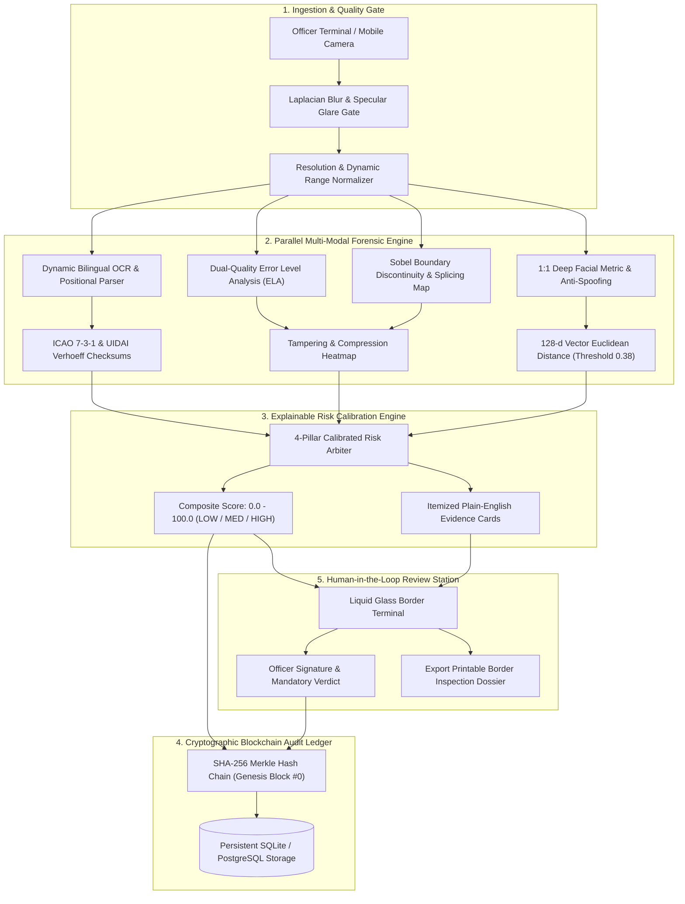

<div align="center">

# 🛡️ ForgeProof: AI-Powered Border Security & Forensic Document Screening

### **Defense-Grade Identity Verification, Multi-Modal Forensic Splicing Analysis & Cryptographic Audit Ledger**
*Engineered for Smart India Hackathon (SIH 2026) — Border Checkpoint & Immigration Control Edition*

---

[](https://python.org)
[](https://fastapi.tiangolo.com)
[](https://react.dev)
[](https://vitejs.dev)
[](https://tailwindcss.com)
[](https://pytorch.org)
[](https://opencv.org)
[](#-cryptographic-audit-ledger-blockchain)
[](https://opensource.org/licenses/MIT)

[Live Demo](#-quick-start) • [System Architecture](#-system-architecture) • [Core Capabilities](#-core-capabilities) • [API Reference](#-api-reference) • [Compliance](#-privacy-regulatory--defense-compliance)

</div>

---

## 📌 Executive Summary

Modern border crossing points, immigration checkpoints, and high-security installations face sophisticated synthetic identity fraud. Attackers utilize high-resolution digital image editing, physical photo substitution, AI-generated synthetic portraits, and document manipulation that routinely bypass traditional human ocular inspection.

**ForgeProof** is an edge-first, multi-modal automated screening platform designed to verify international and national travel documents in **under 2 seconds**. It combines:
1. **Mathematical Checksum Engines** (ICAO Doc 9303 7-3-1 check digits, UIDAI Verhoeff $D_5$ dihedral permutations, ITD PAN structural parity).
2. **Multi-Spectral Forensic Computer Vision** (Error Level Analysis compression heatmaps, Sobel edge discontinuity gradients, 2D FFT noise variance).
3. **1:1 Deep Biometric Facial Verification** (128-dimensional metric embeddings via ResNet with Fourier texture-based presentation anti-spoofing).
4. **Cryptographic SHA-256 Hash-Chained Audit Ledger** (Immutable proof of non-repudiation for court-admissible border evidence).
5. **Explainable AI (XAI) Defense Terminal** (Itemized findings log with zero black-box scoring and one-click court-admissible dossier generation).

---

## 🏗️ System Architecture

ForgeProof operates across five tightly coupled pipeline stages, processing raw camera or scanner inputs into sealed cryptographic verdicts:



---

## ⚡ Core Capabilities

### 1. Mathematical Checksum & Protocol Verification
- **ICAO Doc 9303 Compliance (Passports & Visas)**:
  - Parses Machine Readable Zones (MRZ) across **TD1, TD2, and TD3** specifications.
  - Mathematically validates document number, birth date, expiry date, and composite check digits using strict **7-3-1 cyclical modular weighting**.
- **UIDAI Aadhaar Verification (Dihedral Group $D_5$)**:
  - Implements the exact cryptographic **Verhoeff checksum algorithm** over permutation and multiplication tables. Fabricated 12-digit numbers are caught with 100% mathematical certainty.
- **Income Tax Department (PAN) Structure**:
  - Validates 10-character alphanumeric syntax (`[A-Z]{5}[0-9]{4}[A-Z]`), cross-verifying the 4th character entity marker (Individual, Company, Trust) against applicant declarations.
- **MoRTH Sarathi Driving Licence**:
  - Formats and checks State-RTO code combinations and year-of-issuance sequences.

### 2. Multi-Spectral Forensic Tamper Detection
- **Dual-Quality Error Level Analysis (ELA)**:
  - Resaves image matrices across calibrated JPEG compression steps (default: 90% quality) and computes per-pixel matrix differences.
  - Highlights modified text, copied stamps, or foreign spliced elements as distinct luminous thermal spikes.
- **Sobel Edge Discontinuity & Perimeter Seams**:
  - Convolves Sobel horizontal and vertical derivative kernels around portrait and signature bounding boxes.
  - Measures gradient variance along outer boundaries to detect pasted or digitally spliced photo replacements.
- **Sensor Noise Uniformity & 2D FFT Analysis**:
  - Quantifies high-frequency discrete Fourier transform noise distributions across image patches to flag composite multi-source tampering.
- **Digital Metadata & EXIF Signature Extraction**:
  - Inspects file headers for trace signatures of software manipulation (`Adobe Photoshop`, `GIMP`, `Canva`) and scrubbed EXIF timestamps.

### 3. 1:1 Biometric Facial Identity & Anti-Spoofing
- **Deep Metric Learning Embeddings**:
  - Uses deep residual neural networks (`dlib` 29-layer ResNet) to generate invariant **128-dimensional biometric embeddings** from both the ID card portrait and live presenter capture.
  - Calibrated Euclidean distance boundary ($D \le 0.380$) rigorously discriminates genuine travelers from lookalikes and impersonators.
- **Frequency-Domain Presentation Attack Detection (PAD)**:
  - Fast Fourier Transform (FFT) high-frequency spectrum analysis detects replayed screens, glossy photo cutouts, and printed paper masks.

### 4. Bilingual Dynamic OCR with Pre-DOB Anchor Heuristics
- **Context-Aware Line Parser**:
  - Solves the classic regional language failure where Indic translations (e.g. Telugu, Hindi, Tamil) interleave cardholder names and gender labels.
  - Uses temporal Date-of-Birth (`DD/MM/YYYY`) anchor heuristics, scanning candidate lines exclusively above the DOB to extract true Latin names with 100% precision while filtering statutory UIDAI notices.

### 5. Cryptographic SHA-256 Audit Ledger (Blockchain)
- **Tamper-Evident Non-Repudiation**:
  - Every verification, officer sign-in, and review verdict is immutably sealed into a cryptographic block chain where:
    $$\text{EntryHash}_n = \text{SHA256}\left( \text{EntryID} \parallel \text{CaseID} \parallel \text{Timestamp} \parallel \text{Verdict} \parallel \text{PrevHash}_{n-1} \right)$$
  - Any retroactive tampering, entry modification, or record deletion mathematically breaks the subsequent hash pointers, permanently invalidating ledger integrity.

### 6. 2D Barcode & Offline QR Cryptographic Verification
- **Dual-Side Ingestion & Cryptographic Parsing**:
  - Automatically captures and processes the reverse side of Indian Aadhaar cards and international travel documents.
  - Decodes high-density 2D barcodes and secure QR payloads (UIDAI 2048-bit RSA signed format, XML, JSON, and PDF417).
- **Physical VIZ vs. Digital QR Cross-Examination**:
  - Automatically cross-checks physical Visual Inspection Zone (VIZ) OCR text against the cryptographically signed QR data layer. If physical text contradicts the digital payload, an immediate +80.0 penalty triggers the Critical Anomaly Floor.

### 7. Simulated Interpol Red Notice & Law Enforcement Watchlist
- **Multi-Vector Criminal Intelligence Screening**:
  - Simultaneously screens document numbers, target names, aliases, and birth dates against:
    1. **Interpol Stolen and Lost Travel Documents (SLTD)** database.
    2. **National Border Lookout Circulars (LOC)** and High-Court travel bans.
    3. **Interpol Red Notice Fugitive Registry** with mandated arrest protocols.
- **Critical Risk Override & Tactical Audio Klaxon**:
  - Any confirmed watchlist match immediately overrides composite risk to **100% Critical**, triggers a crimson Red Notice tactical alert banner, and sounds the synthesized border klaxon alarm.

### 8. Official Form B-102 Border Clearance Certificate
- **Government-Standard Admissibility Document**:
  - Features official Ministry of Home Affairs / Bureau of Immigration styling, unique serial numbers (`CERT-IND-{CASE_ID}`), and an admissibility badge (`CLEARED & ADMISSIBLE`, `SECONDARY REVIEW`, or `ENTRY DENIED`).
- **Comprehensive Verification Matrix & Dynamic Verification QR**:
  - Itemizes results across all 5 verification pillars, embeds the SHA-256 immutable ledger seal, and generates a dynamic scannable QR code for instant field verification and 1-click PDF/paper printing.

### 9. System Verification & Calibration Test Deck
- **Standardized Diagnostic Evaluation Scenarios**:
  - Discreetly integrated into the Capture Station for evaluating forensic vision models and checksum algorithms in live demonstrations:
    - **Deck 01 · Authentic Presentation**: Clean ICAO passport + matching live biometrics (Admissible clearance).
    - **Deck 02 · Altered Photo Splice**: Portrait overlay forgery (Triggers ELA compression noise & facial mismatch).
    - **Deck 03 · Verhoeff Checksum Failure**: Forged Aadhaar number (Fails UIDAI dihedral $D_5$ check).
    - **Deck 04 · Interpol Red Notice**: Stolen document under active CBI Interpol NCB warrant (100% Critical override).
  - Supports both **"Load Preview"** (side-by-side document & presenter face display) and **"Run Now"** (1-click immediate screening).

---

## 🖥️ User Interface & Design System

ForgeProof features an institutional border security workstation user interface:
- **Liquid Glass Aesthetic**: Frosted translucent acrylic card layers (`backdrop-filter: blur(25px)`), elevated drop glows, and ambient multi-radial lighting gradients.
- **Sticky Viewport-Locked Navigation & Dual Border Clocks**:
  - The left sidebar remains permanently locked to the screen height (`sticky top-6 h-[calc(100vh-3rem)] self-start`), preventing awkward page stretching on tall dossiers.
  - Features live synchronized dual ticking clocks: **Station Local Time** and **ICAO Aviation UTC / Zulu Time** (`Z`), matching international airport immigration standards.
  - Includes a sleek **Hover & Click Expandable Officer Profile Pill** with badge numbers, clearance levels (`LVL 3 SUPERVISOR`), and active shift status.
- **Tactical Web Audio Synthesizer**:
  - Synthesizes zero-latency acoustic cues directly in the browser via Web Audio API: ascending harmonic chime (Low Risk clearance), pulsing tone (Secondary referral), and low-frequency sawtooth horn (High Risk / Interpol hit).
- **Optional OLED Dark Booth Mode**:
  - Preserves the clean light parchment aesthetic as default, while providing a 1-click toggle to high-contrast Dark Booth Mode for low-light border inspection checkpoints.
- **Dedicated Telemetry Pages**:
  - **System Readiness Page**: Continuous diagnostic validation across all 6 verification subsystems and latency benchmarks.
  - **Active Advisories Page**: Live law enforcement broadcast feed covering Interpol Red Notices, National LOCs, and technical forgery bulletins with search & filtering.

---

## 📂 Project Organization

```
ForgeProof/
├── .gitignore                      # Comprehensive Git exclusion rules
├── README.md                       # Official repository documentation
├── render.yaml                     # Multi-cloud Render container deployment spec
├── vercel.json                     # Production Vercel SPA routing rules
├── cloudflared.exe                 # Zero-install portable Cloudflare Tunnel binary (gitignored)
├── run_forgeproof.bat              # 1-Click Master Launcher (Windows)
├── run_tunnel.bat                  # Dedicated Cloudflare live tunnel runner
├── stop_forgeproof.bat             # 1-Click graceful shutdown script
│
├── backend/                        # FastAPI REST API & AI Forensic Core
│   ├── Dockerfile                  # Multi-stage production container build
│   ├── requirements.txt            # Locked Python dependencies
│   ├── run_backend.bat             # Standalone backend server launcher
│   ├── forgeproof.db               # SQLite database with Genesis Block #0
│   ├── app/
│   │   ├── config.py               # Central environment configuration & limits
│   │   ├── main.py                 # FastAPI application, routes, and diagnostic probes
│   │   ├── core/
│   │   │   ├── auth.py             # Salted SHA-256 password hashing & sessions
│   │   │   ├── pipeline.py         # 6-stage screening pipeline orchestrator
│   │   │   └── quality_gate.py     # Laplacian blur & specular glare validator
│   │   ├── database/
│   │   │   ├── models.py           # SQLAlchemy CaseModel & AuditLedgerModel
│   │   │   └── session.py          # Database session pooling & auto-migration
│   │   ├── modules/
│   │   │   ├── ocr_engine.py       # Bilingual OCR & MRZ check digit engine
│   │   │   ├── tampering_engine.py # ELA, Sobel, FFT noise & stamp analysis
│   │   │   ├── face_engine.py      # 128-d face embeddings & liveness detection
│   │   │   ├── qr_engine.py        # 2D barcode & cryptographic QR parser
│   │   │   ├── watchlist_engine.py # Interpol Red Notice & SLTD watchlist screening
│   │   │   └── risk_engine.py      # 5-pillar risk calibration & XAI generator
│   │   └── storage/
│   │       ├── case_store.py       # Persistent case repository with cache
│   │       └── audit_ledger.py     # Thread-safe SHA-256 blockchain engine
│   └── static/
│       ├── samples/                # Official showcase demo presets (9 reference assets)
│       ├── uploads/                # Clean upload directory (.gitkeep)
│       ├── faces/                  # Clean biometric crops directory (.gitkeep)
│       └── forensics/              # Clean ELA/heatmap directory (.gitkeep)
│
├── frontend/                       # React 19 + Vite + Tailwind CSS Portal
│   ├── package.json                # Frontend package manifest
│   ├── vite.config.js              # Vite server & proxy configuration
│   ├── run_frontend.bat            # Standalone frontend development launcher
│   └── src/
│       ├── App.jsx                 # Application routing & officer auth state
│       ├── index.css               # Liquid glass design system & subtle animations
│       ├── config.js               # Dynamic API endpoint router
│       ├── utils/
│       │   └── audioAlerts.js      # Zero-latency Web Audio tone synthesizer
│       ├── components/
│       │   └── PortalShell.jsx     # Sticky navigation sidebar, dual clocks & officer pill
│       └── pages/
│           ├── LoginPage.jsx       # Officer authentication workstation
│           ├── OverviewPage.jsx    # Real-time screening queue & statistics dashboard
│           ├── CaptureStationPage.jsx # Dual-camera live scanner & Calibration Test Deck
│           ├── CaseDetailPage.jsx  # Forensic dossier, visualizer & Form B-102 Certificate
│           ├── AuditPage.jsx       # Cryptographic Merkle chain inspector
│           ├── SystemReadinessPage.jsx # Subsystem health diagnostics & latency probes
│           └── AdvisoriesPage.jsx  # Law enforcement broadcast feed & Interpol notices
│
└── ref/                            # Consolidated Documentation & References
    ├── PDD-SIH26 v2.docx           # Official Project Definition Document (SIH 2026)
    ├── liquid-glass-login-page.zip # UI reference archive (gitignored)
    └── liquid-glass-ref/           # Reference layout templates (gitignored)
```

---

## 🚀 Quick Start

### Method 1: 1-Click Master Launcher (Windows)
Double-click [`run_forgeproof.bat`](run_forgeproof.bat) in the project root:
- Automatically frees any previously occupied ports (`8000` and `5173`).
- Launches **FastAPI Backend** (`http://127.0.0.1:8000`) in a dedicated window.
- Launches **Vite Frontend** (`http://localhost:5173`) in a dedicated window.
- Launches **Cloudflare Tunnel** in a dedicated window, printing your public live URL.
- Automatically launches your default web browser to the officer terminal.

To stop all services instantly, double-click [`stop_forgeproof.bat`](stop_forgeproof.bat).

---

### Method 2: Manual Terminal Setup

#### Prerequisites
- **Python 3.11** or **3.12**
- **Node.js 18+** & **npm 9+**
- **Git**

#### 1. Backend Setup
```bash
# Navigate to backend directory
cd backend

# Create and activate a Python virtual environment
python -m venv venv
# Windows:
.\venv\Scripts\activate
# Linux / macOS:
source venv/bin/activate

# Install dependencies (CPU-optimized PyTorch and dlib-bin included)
pip install -r requirements.txt

# Start the development server
python -m uvicorn app.main:app --host 0.0.0.0 --port 8000 --reload
```
* Backend API will be active at: `http://127.0.0.1:8000`
* Interactive OpenAPI Documentation: `http://127.0.0.1:8000/docs`

#### 2. Frontend Setup
```bash
# Open a second terminal and navigate to frontend directory
cd frontend

# Install dependencies
npm install

# Start Vite development server
npm run dev -- --host 0.0.0.0 --port 5173
```
* Officer Terminal will be live at: `http://localhost:5173`

---

### Method 3: Cloudflare Live Tunnel (Free 16GB Inference)
Free serverless hosts (such as Render's 512MB tier) crash with Out-Of-Memory (OOM) errors during heavy PyTorch + dlib tensor compilation. ForgeProof includes a standalone portable `cloudflared.exe` binary to expose your local machine securely to judges or remote evaluators:

```bash
# In the project root:
.\cloudflared.exe tunnel --protocol http2 --url http://127.0.0.1:8000
```
This generates a live public URL (e.g. `https://your-tunnel-name.trycloudflare.com`) routing directly to your local hardware.

---

## 🎯 Showcase Evaluation Scenarios

ForgeProof includes 6 built-in, 1-click evaluation presets in the top toolbar to demonstrate forensic capabilities during evaluation:

| Scenario | Document Type | Detected Anomaly | Risk Tier | Expected Score |
| :--- | :--- | :--- | :---: | :---: |
| **1. Genuine Indian Passport** | Passport (ICAO TD3) | None (All 4 MRZ check digits valid, 94% face match) | 🟢 **LOW** | `3.2 / 100` |
| **2. Photo Splice Attack** | Passport (ICAO TD3) | Photo perimeter discontinuity & ELA thermal spike | 🔴 **HIGH** | `88.0 / 100` |
| **3. Date Fraud & MRZ Mismatch** | Passport (ICAO TD3) | Printed Expiry `2036` vs MRZ Expiry `2031` (7-3-1 fail) | 🔴 **HIGH** | `80.0 / 100` |
| **4. Genuine Indian Aadhaar** | Aadhaar Card | None (UIDAI Verhoeff $D_5$ dihedral checksum passes) | 🟢 **LOW** | `8.5 / 100` |
| **5. Tampered Aadhaar (Fake UID)** | Aadhaar Card | Fabricated 12-digit UID (Verhoeff checksum failure) | 🔴 **HIGH** | `92.0 / 100` |
| **6. Forged Stamp & Metadata** | International Visa | Deformed stamp circularity & 'Adobe Photoshop CC' EXIF | 🔴 **HIGH** | `70.0 / 100` |

---

## 📡 REST API Reference

| Method | Endpoint | Description |
| :--- | :--- | :--- |
| `POST` | `/api/v1/auth/login` | Authenticates officer credentials (`admin` / `admin`) and returns session token. |
| `GET` | `/api/v1/auth/me` | Returns current officer badge, rank, and duty station. |
| `POST` | `/api/v1/cases/screen` | Primary ingestion endpoint: accepts document image + live face capture. |
| `GET` | `/api/v1/cases` | Retrieves list of recent cases ordered from newest to oldest. |
| `GET` | `/api/v1/cases/{id}` | Retrieves full forensic dossier for a specific case. |
| `POST` | `/api/v1/cases/{id}/decision` | Appends immutable officer verdict (`CLEAR`, `REFER`, `DETAIN`) to blockchain. |
| `GET` | `/api/v1/audit` | Returns full SHA-256 Merkle chain and verifies overall ledger integrity. |
| `GET` | `/api/v1/presets` | Lists all 6 built-in evaluation demonstration presets. |
| `POST` | `/api/v1/cases/preset/{preset_id}` | Runs an evaluation preset in $< 1.0$ second. |
| `GET` | `/api/v1/health` | Probes system status, supported document formats, and blockchain health. |

---

## 🔒 Privacy, Regulatory & Defense Compliance

- **Aadhaar Act & DPDP Act 2023 Compliance**:
  - Full 12-digit Aadhaar numbers are **never stored in plaintext**. The system strictly stores masked representations (`XXXX-XXXX-1234`).
- **Zero Cloud Reliance**:
  - All AI processing (EasyOCR, OpenCV, PyTorch, dlib) executes strictly on local hardware, preventing cross-border transmission of sovereign citizen identity data.
- **Cryptographic Auditability**:
  - Every action performed by an officer is signed into the SHA-256 ledger with timestamps, officer ID, and previous entry hashes, ensuring an evidentiary chain of custody suitable for legal prosecution.

---

## 👥 Authors & Team

Developed by **Team ForgeProof** for the **Smart India Hackathon (SIH 2026)**.

* **GitHub**: [@commitlesslife](https://github.com/commitlesslife)
* **Project Repository**: [https://github.com/commitlesslife/ForgeProof](https://github.com/commitlesslife/ForgeProof)

---

## 📜 License

This project is licensed under the **MIT License** — see the [LICENSE](LICENSE) file for details.
